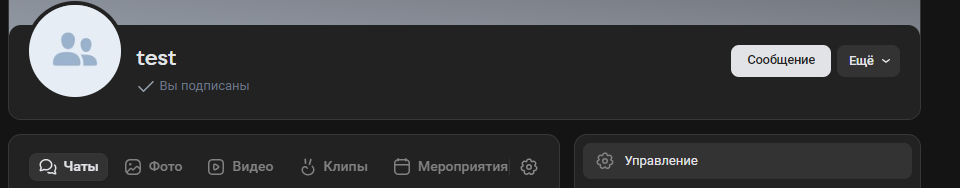
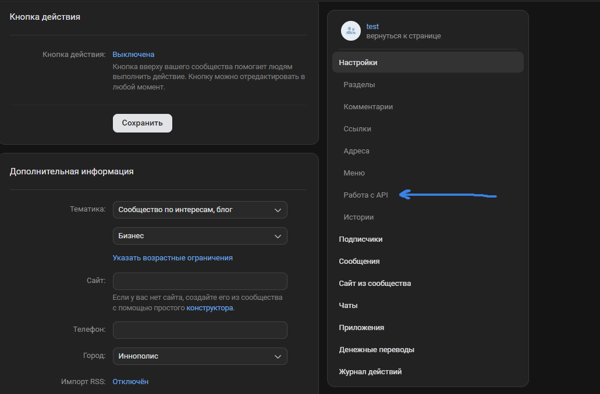
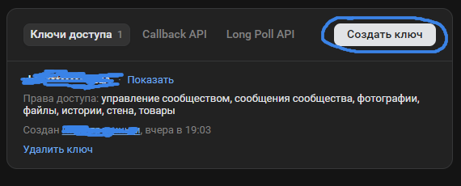
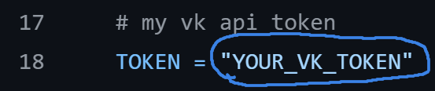
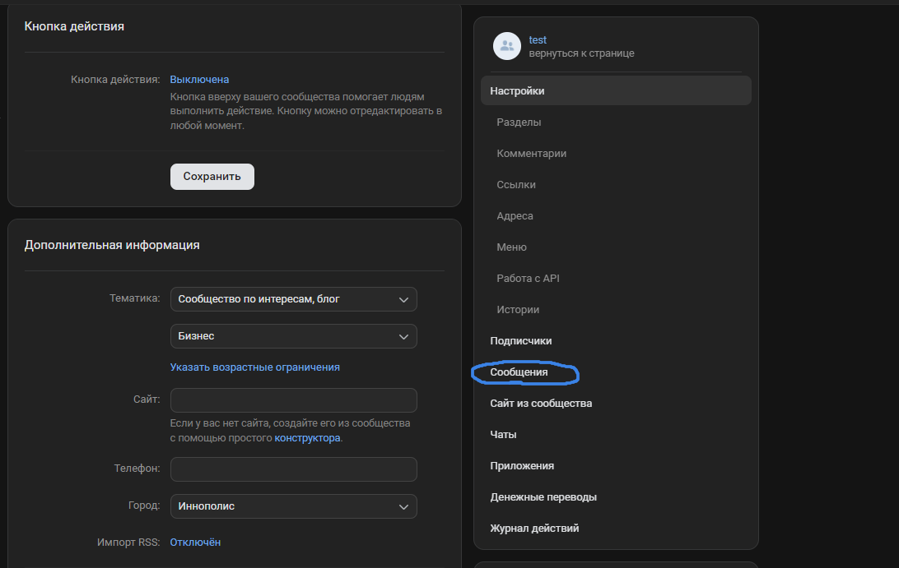
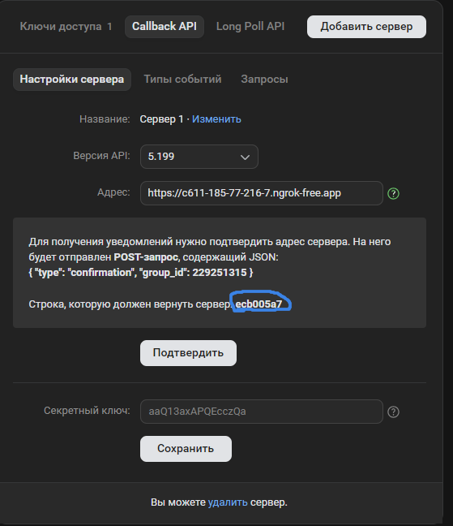
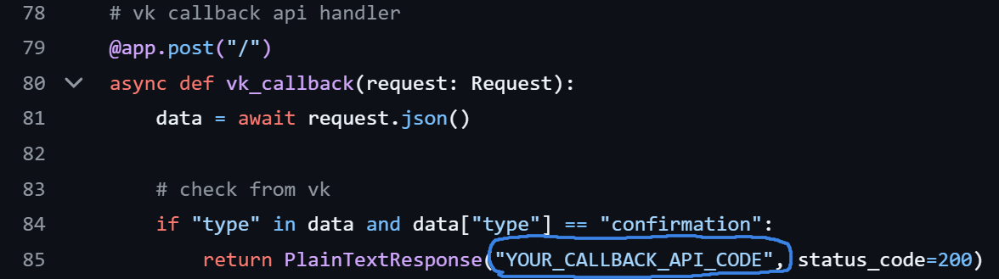
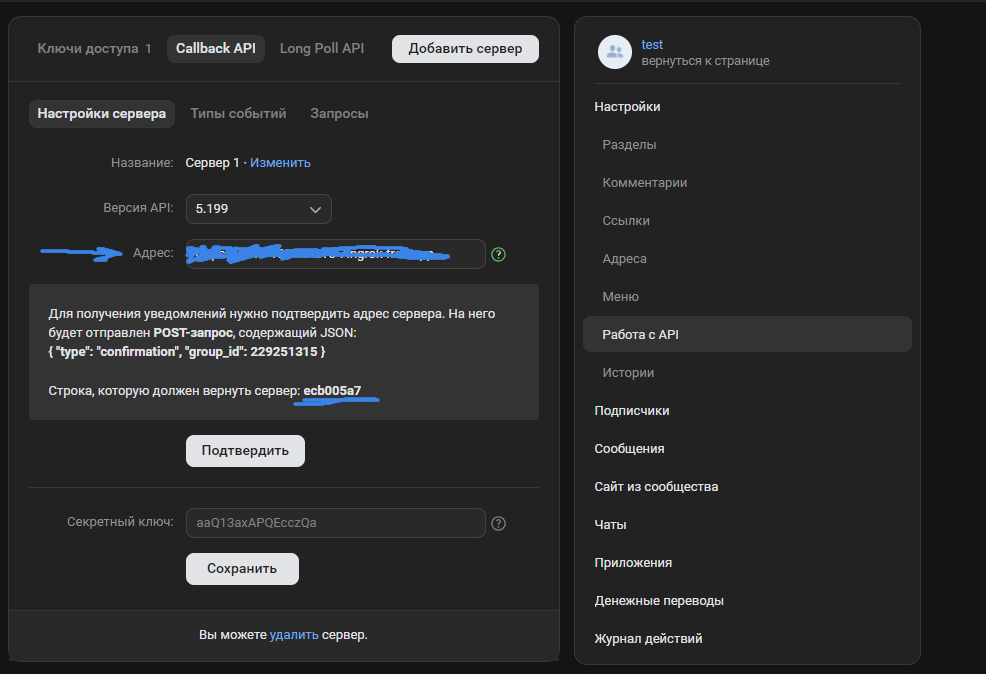

# vkbot
Этот проект является простейшей реализацией бота для группы вконтакте, который отвечает на первое сообщения пользователя, игнорируя все последующие, кроме фотографий, которые он присылает обратно.
## Настройка

1) Необходимо создать группу Вконтакте.

   


3) Перейти в управление




 
5) Работа с API





7) Создать ключ, в правах доступа разрешить управление сообществом, сообщения сообщества, фотографии, файлы.




   
9) Вставляем полученный API в код в файл ```bot.py``` в переменную TOKEN вместо ```"YOUR_VK_TOKEN"``` (строка 18)





10) Зайти в управление группой, перейти в сообщения и включить их




    
12) Далее, скачиваем [ngrok](https://ngrok.com). распаковываем архив в любую папку, копируем путь к папке и добавляем его в переменную PATH

14) Регистрируемся на сайте, пишем в консоль (ваш токен будет отображаться на сайте ngrok)
```bash
ngrok config add-authtoken $YOUR_AUTHTOKEN
```
6) устанавливаем необходимые зависимости
```bash
pip install -r requirements.txt
```
8) Вставляем в код вместо ```YOUR_CALLBACK_API_CODE``` значение, указанное в (Строка, которую должен вернуть сервер:), на странице Callback_API (управление, работа с API, callback API).







10) Запускаем код:
```bash
uvicorn bot:app --host 0.0.0.0 --port 8000 --reload
```

12) Прописываем в bash консоль
```bash
ngrokk http 8000
```

14) На странице Callback_API вставляем в поле Адрес то, что нам выдаёт консоль после исполнения 9) пункта после слова Forwarding (до символа ->).





15) Нажимаем подтвердить, должен прийти успешный ответ.

16) Готово! Вы можете писать в группу, а бот будет вам отвечать
