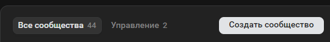

# vkbot
Этот проект является простейшей реализацией бота для группы вконтакте, который отвечает на первое сообщения пользователя, игнорируя все последующие, кроме фотографий, которые он присылает обратно.
## Настройка

1) Необходимо создать группу Вконтакте.

3) Перейти в управление,
4) работа с API, создать ключ, в правах доступа разрешить управление сообществом, сообщения сообщества, фотографии, файлы.
5) Вставляем полученный API в код в файл ```bot.py``` в переменную TOKEN вместо ```"YOUR_VK_TOKEN"``` (строка 18)
6) Зайти в управление группой, перейти в сообщения и включить их
7) Далее, скачиваем ngrok. распаковываем архив в любую папку, копируем путь к папке и добавляем его в переменную PATH
8) Регистрируемся на сайте, пишем в консоль (ваш токен будет отображаться на сайте ngrok)
```bash
ngrok config add-authtoken $YOUR_AUTHTOKEN
```
6) устанавливаем необходимые зависимости
```bash
pip install -r requirements.txt
```
8) Вставляем в код вместо ```YOUR_CALLBACK_API_CODE``` значение, указанное в (Строка, которую должен вернуть сервер:), на странице Callback_API (управление, работа с API, callback API).
9) Запускаем код
10) Прописываем в bash консоль ```bash
ngrokk http 8000```

12) На странице Callback_API вставляем в поле Адрес то, что нам выдаёт консоль после исполнения 9) пункта после слова Forwarding (до символа ->).
13) Нажимаем подтвердить, должен прийти успешный ответ.
14) Готово! Вы можете писать в группу, а бот будет вам отвечать
